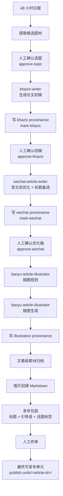

# AI杨侦探工作流

一个私有的 AI 内容生产工作流项目：先从 **152 个信息源**生成结构化日报，再围绕当天最值得写的题材，继续完成公众号转稿、插图规划与生成、素材归档、成稿定稿和最终发文包装。

## 正式流程图



## 信息源说明（当前默认配置）

- 总信息源：**152 个**
- 构成：
  - **92 个**：Karpathy 推荐基础源（HN 技术博客集合）
  - **59 个**：`spsz0831` 补充 RSS / Atom 源（中文/垂直渠道等，含 `wise.readwise.io/feed`）
  - **1 个**：自定义页面抓取源（`https://huggingface.co/papers`）

- 当前特别包含：
  - `https://www.bensbites.com/feed`
  - `https://wise.readwise.io/feed`
  - `https://huggingface.co/papers`

> 源列表维护在 `scripts/digest.ts` 中，可按需继续增删。

---

## 核心功能

### 1) 48 小时日报生成
- 聚合抓取 RSS / Atom 信息源
- 支持 24h / 48h / 72h / 7d 时间窗口
- 输出结构化 Markdown 日报与健康日志

### 2) 公众号候选题筛选
- 从日报候选里优先挑出更适合公众号长文的题材
- 强调“当天值得写”的事件感、传播性和判断空间
- 不再把日报内容机械照单全收

### 3) 公众号长文初稿生成
- 基于选中的日报题材生成公众号 Markdown 初稿
- 支持 AI 新闻观察 / 趋势判断型写法
- 适配 AI杨侦探账号的个人观察表达

### 4) 发文态优化与发布包装
- 补齐标题备选、引导语备选、话题标签
- 输出更接近可直接发布的公众号稿
- 支持从初稿继续整理成完整发文单元

AI杨侦探账号默认发文态约定：

- 优化稿开头优先先点明“这条具体新闻是什么”，不要一上来就直接进入抽象评论
- 若素材来自独家报道或具体信源，开头应尽快交代来源、核心事件和关键数字
- 优化稿结尾默认追加 AI杨侦探固定尾注，除非用户当次明确要求不加
- 当前固定尾注为：

```md
---

<br/>

如果你觉得这篇内容有价值，欢迎点个赞、点个在看，也欢迎转发给更多朋友。

我是 `AI杨侦探`，持续记录 AI、技术、产品和产业变化里那些真正值得看、值得想的事。

谢谢你读到这里，我们下次见。
```

### 5) 插图规划与生成
- 按文章结构生成插图位规划和批量生图配置
- 支持文章级插图目录、提示词与批处理文件
- 形成与正文结构对应的插图资产

### 6) 素材归档与成稿定稿
- 把图片、提示词、元数据归档到文章专属目录
- 把相对路径回写进 Markdown 正文
- 交付“文章 + 插图目录 + 标题 + 引导语 + 标签”的完整发布单元

---

## 环境要求

- Windows（已内置 `.cmd` 快捷入口）
- Node.js / npm（用于 `npx`)
- Bun（可通过 `npx -y bun` 自动拉起）
- 至少一个 API Key：
  - `GEMINI_API_KEY`（推荐）
  - 或 `OPENAI_API_KEY`（兜底或单独使用）

## 外部依赖 Skill 清单

这套项目的完整链路不仅依赖仓库内脚本，也依赖你本机全局安装的外部 skill。当前这台机器上，第 4/5/6/7 步对应的 skill 本体不在仓库目录里，而是在 `C:\Users\spsz0\.cc-switch\skills\` 下。

必需 skill：

- `khazix-writer`
  - 用途：第 4 步，生成公众号长文初稿
  - 当前本机路径：`C:\Users\spsz0\.cc-switch\skills\khazix-writer\SKILL.md`
- `wechat-article-writer`
  - 用途：第 5 步，做公众号发文态优化，并默认产出标题备选
  - 当前本机路径：`C:\Users\spsz0\.cc-switch\skills\wechat-article-writer\SKILL.md`
- `baoyu-article-illustrator`
  - 用途：第 6 步插图规划，第 7 步插图生成
  - 当前本机路径：`C:\Users\spsz0\.cc-switch\skills\baoyu-article-illustrator\SKILL.md`

关键边界：

- `skill 文件存在于 C:\Users\spsz0\.cc-switch\skills\` 不等于当前 Codex 窗口一定可调用
- 对当前窗口来说，只有出现在会话 developer prompt 的 `Available skills` 列表里，才算真正注入成功
- `khazix-writer` 和 `wechat-article-writer` 任何一个未出现在 `Available skills` 里，都不能把当前窗口当成正式双 skill 写作环境
- 仓库提供显式校验脚本：`scripts\check-codex-required-skills.cmd`

工作流层说明：

- 这个仓库定义流程顺序、输出目录、归档规范和脚本入口
- 上述 skill 负责写作优化、插图规划和插图生成等内容生产动作
- 如果换机器或给别人复用，除了拉取本仓库，还需要先在那台机器上安装这些 skill，否则第 4/5/6/7 步无法按当前工作流执行
- 第 6/7 步在工作流对外描述中统一归属 `baoyu-article-illustrator`，不要再拆成其它 skill 名称

---

## 快速开始

### 1) 克隆仓库

```bash
git clone https://github.com/spsz831/ai-yang-detective-workbench.git
cd ai-yang-detective-workbench
```

### 2) 配置环境变量

参考 `.env.example`（不要提交真实密钥）：

```bash
GEMINI_API_KEY=
OPENAI_API_KEY=<your-openai-compatible-key>
GEMINI_MODEL=gemini-3.1-pro-preview
OPENAI_API_BASE=http://localhost:20128/v1
OPENAI_MODEL=wzw/gpt-5.5
# OPENAI_WIRE_API=responses
```

说明：

- 当前更推荐把项目统一接到本机 `9router`，而不是在每个项目里直填上游站点 key
- 本项目代码读取的是 `OPENAI_API_BASE`，不是 `OPENAI_BASE_URL`
- 如果你暂时不用 Gemini，可以把 `GEMINI_API_KEY` 留空
- 如果你的本地路由默认更适合走 `/responses`，可显式加上 `OPENAI_WIRE_API=responses`

---

## 使用方式

这个项目当前有 5 种常用运行方式。

### 常用脚本职责对照

| 脚本 | 作用 | 适用阶段 |
| --- | --- | --- |
| `scripts\run-digest-and-gzhrb.cmd` | 生成日报、提取候选题，并创建正式写作工作单 | 日报后，进入正式写作前 |
| `scripts\run-digest-gzhrb-publish-pipeline.cmd` | 生成日报、候选题和工作单，停在正式写作关口 | 预写作入口 |
| `scripts\gzhrb-writing-state.cmd` | 用统一入口执行 `inspect`、`mark-*`、`approve-*`、状态概览 | 写作状态统一入口 |
| `scripts\inspect-gzhrb-writing-state.cmd` | 查看 workitem 声明状态、文件证据状态、最近执行日志和下一步 | 写作状态检查 |
| `scripts\mark-gzhrb-khazix-complete.cmd` | 显式回写 `khazix` 初稿已完成状态并追加执行日志 | 初稿完成后 |
| `scripts\mark-gzhrb-wechat-complete.cmd` | 显式回写 `wechat` 优化稿已完成状态并追加执行日志 | 优化稿完成后 |
| `scripts\write-gzhrb-provenance.cmd` | 为正式 skill 执行写入 `provenance` 留痕 | 每个正式 skill 执行完成后 |
| `scripts\approve-gzhrb-stage.cmd` | 为选题、初稿、优化稿、插图阶段写入人工确认 | 每个关口人工确认时 |
| `scripts\run-gzhrb-postwriting-pipeline.cmd` | 先显式 inspect 当前写作状态，再继续插图规划、生成、归档、定稿、发布包装 | 写作完成后 |
| `scripts\plan-gzhrb-illustrations.cmd` | 生成文章级插图规划、插图位和提示词 | 插图规划 |
| `scripts\generate-gzhrb-illustrations.cmd` | 按规划生成插图素材 | 插图生成 |
| `scripts\organize-gzhrb-illustrations.cmd` | 把插图、提示词、元数据整理到文章级目录 | 插图归档 |
| `scripts\finalize-gzhrb-article.cmd` | 把图片路径回填到 Markdown，完成文章定稿 | 定稿 |
| `scripts\package-gzhrb-article.cmd` | 补齐标题备选、引导语备选、话题标签等发文包装 | 发布包装 |
| `scripts\check-codex-required-skills.cmd` | 检查当前 Codex 窗口是否已注入正式写作必需 skill | 正式写作前校验 |
| `scripts\analyze-ai-digest-health.cmd` | 基于最近健康日志生成 Markdown 健康分析报告 | 日报健康复盘 |

### 1) 双击 `.cmd` 启动

直接运行：

```bat
scripts\ai-daily-digest-launcher.cmd
```

适合：
- 日常手动使用
- 不想记参数
- 只生成日报

### 2) PowerShell / 终端命令执行

```powershell
npx -y bun scripts/digest.ts --hours 48 --top-n 15 --lang zh --output ./reports/output/ai-daily-digest-manual.md --health-log ./reports/health/run-manual.json
```

常用参数：
- `--hours <n>`
- `--top-n <n>`
- `--lang zh|en`
- `--waytoagi-limit <n>`
- `--output <path>`
- `--health-log <path>`

### 3) 在 Codex / Claude Code 中执行

代理本质上也是执行这两个入口之一。推荐直接让代理运行下面两种命令：

```text
请在项目目录执行：scripts\ai-daily-digest-launcher.cmd
```

或：

```text
请在项目目录执行：npx -y bun scripts/digest.ts --hours 48 --top-n 15 --lang zh --output ./reports/output/ai-daily-digest-manual.md --health-log ./reports/health/run-manual.json
```

如果你准备进入正式双 skill 写作阶段，先在当前 Codex 窗口对应的本机环境执行：

```bat
scripts\check-codex-required-skills.cmd
```

只有当输出同时包含：

- `[OK] khazix-writer`
- `[OK] wechat-article-writer`

才允许继续把当前窗口当成正式写作环境。

### 4) 一键跑“日报 + 候选题 + 写作工作单”

如果你希望在同一轮里先生成日报，再完成候选题筛选和正式写作工作单准备，可以直接运行：

```bat
scripts\run-digest-and-gzhrb.cmd
```

这个入口会：

1. 先按你在启动器里选择的参数生成日报  
2. 再从刚生成的日报里提取 3-5 个候选题  
3. 停在人工选题关口  
4. 为选中的题材创建双 skill 写作工作单  
5. 输出 `khazix-writer` 初稿路径、`wechat-article-writer` 优化稿路径和工作单路径

### 5) 预写作入口 + 写作后续入口

预写作入口：

```bat
scripts\run-digest-gzhrb-publish-pipeline.cmd
```

它现在只执行前半段：

1. 日报生成  
2. 候选题提取  
3. 人工确认选题  
4. 创建双 skill 写作工作单  
5. 停在正式写作关口

写作完成后，再继续执行后半段：

```bat
scripts\run-gzhrb-postwriting-pipeline.cmd "E:\WorkCodex\ai-daily-digest\reports\gzhrb\articles\<article-id>\article.md"
```

后半段会顺序执行：

1. 插图规划  
2. 插图生成  
3. 插图整理归档  
4. 文章定稿  
5. 发布包装

说明：
- 正式写作阶段必须由外部 `khazix-writer` 和 `wechat-article-writer` 接管。
- 进入后半段前，必须同时具备三类证据：真实产物文件、对应 `provenance`、对应 `approval`。
- 仓库内不再保留旧 `generate-gzhrb` 兼容入口，避免和正式双 skill 写作链路混淆。

### 脚本运行约定

- 面向日常使用的 `.cmd` 入口优先保证可双击运行。
- 双击运行时，脚本应默认保留结果窗口，避免“一闪而过”。
- 如果需要在终端里无暂停执行，优先使用脚本提供的显式参数，例如 `--no-pause`。
- 进入正式双 skill 写作阶段前，先运行 `scripts\check-codex-required-skills.cmd`，不要只根据本机 skill 安装目录做口头判断。

### 日报健康分析

如果你想复盘最近几次日报抓取质量，可以运行：

```bat
scripts\analyze-ai-digest-health.cmd
```

默认行为：

- 读取最近若干次 `reports\health\run-*.json`
- 统计每个源的 `ok / empty / error`
- 生成一份 Markdown 报告到 `reports\health\health-analysis-*.md`

如果你想在终端里无暂停运行最近 7 次：

```bat
scripts\analyze-ai-digest-health.cmd --no-pause -Last 7
```

---

## 当前默认工作流（你这套本地环境）

当前默认配置：

- 主模型：`9router / wzw/gpt-5.5`
- 可选协议：`responses`（推荐用于本机 `http://localhost:20128/v1`）
- 公众号转稿默认模式：`ai-observation（AI新闻观察 / 趋势判断型）`
- 公众号风格样本目录：`E:\杨侦探\公众号抓取下载`

当前已落地的真实流程：

1. 抓取 RSS / Atom 信息源
2. 按时间窗口过滤文章
3. 用 AI 做打分、分类、摘要与 highlights
4. 生成日报 Markdown 到 `reports/output`
5. 从日报里提取 3-5 个公众号候选题并排序
6. 人工确认当天题材
7. 创建文章级写作工作单，产出固定的初稿路径、优化稿路径和插图目录
8. 等待外部双 skill 写作产物落盘
9. 对优化稿继续执行插图规划、插图生成、归档、回填和发布包装

### 模型与能力来源

下面这张对照表用来区分：哪些步骤会读取当前 `.env` 里的 `OPENAI_API_BASE` / `OPENAI_MODEL`，哪些步骤属于外部 skill，哪些只是纯本地文件处理。

| 流程步骤 | 主要入口 | 能力来源 | 是否读取当前 `.env` 模型配置 |
| --- | --- | --- | --- |
| 日报生成 | `scripts\digest.ts` | 本地 `9router` 模型 | 是 |
| 候选题提取 | `scripts\select-gzhrb-topic.ts` | 纯本地文件处理 | 否 |
| 写作工作单准备 | `scripts\prepare-gzhrb-writing-workspace.ps1` | 纯本地文件处理 | 否 |
| 选题审批 / 状态推进 / provenance / 校验 | `approve-*` / `mark-*` / `inspect-*` / `validate-*` / `write-gzhrb-provenance*` | 纯本地文件处理 | 否 |
| `khazix-writer` 初稿 | 外部 skill | 外部 skill | 否 |
| `wechat-article-writer` 优化稿 | 外部 skill | 外部 skill | 否 |
| `baoyu-article-illustrator` 插图规划 / 生成 | 外部 skill | 外部 skill | 否 |
| 插图归档 / 图片回填 / 定稿 | `organize-*` / `finalize-*` | 纯本地文件处理 | 否 |
| 发布包装（标题 / 引导语 / 话题标签） | `scripts\package-gzhrb-article.ts` | 本地 `9router` 模型 | 是 |

当前这套本地环境下，真正会使用你当前模型和本地路由 API 的核心只有两段：

- 日报生成阶段的 AI 打分、分类、摘要和 highlights
- 发布包装阶段的标题备选、引导语备选和话题标签生成

如果你切换了 `.env` 里的 `OPENAI_MODEL`，最直接受影响的也是这两段；正式双 skill 写作链路和状态机校验链路不会直接跟着变。

### 正式写作前强校验

在第 8 步之前，必须先做一次当前窗口 skill 注入检查：

```bat
scripts\check-codex-required-skills.cmd
```

硬规则：

- 若缺少 `khazix-writer`，不得把手工写出的初稿描述成 `khazix-writer` 初稿
- 若缺少 `wechat-article-writer`，不得把手工优化稿描述成 `wechat-article-writer` 优化稿
- 若两者任意一个缺失，当前窗口只能用于继续排查、记录工作单、或改仓库代码，不能声称已完成正式双 skill 写作
- 只有优化稿文件真实存在于文章正式路径后，才允许进入插图规划和后续发布包装

### 正式双 skill 留痕执行

这里要明确区分两种写法：

- `按 skill 规范写`：当前窗口参考 `khazix-writer` / `wechat-article-writer` 的写法要求和风格约束，由当前 agent 直接写稿
- `正式双 skill 留痕执行`：必须先创建工作单，再由 `khazix-writer` 产出初稿、由 `wechat-article-writer` 产出优化稿，并把两步的真实文件产物写入固定路径

本项目现在对“正式进入后半段”的判断，不再只看文件存在，而是同时看文件证据、`provenance` 和 `approval`。

当前状态机如下：

- `awaiting_topic_approval`：候选题已提取，但还没做人工选题确认
- `awaiting_khazix_execution`：题材已确认，等待 `khazix-writer` 正式执行
- `awaiting_khazix_approval`：`khazix` 初稿与执行留痕已到位，等待人工确认
- `awaiting_wechat_execution`：等待 `wechat-article-writer` 正式执行
- `awaiting_wechat_approval`：优化稿与执行留痕已到位，等待人工确认
- `awaiting_illustration_execution`：等待 `baoyu-article-illustrator` 完成插图规划与生成
- `ready_for_publish_unit`：允许进入定稿与发布包装
- `completed`：文章级 publish-unit 已完整生成

补充规则：

- `reports/gzhrb/drafts/*-khazix.md` 里的 `khazix-writer 初稿占位文件` 不是正式初稿，只是固定写作路径
- 只有 `reports\gzhrb\articles\<article-id>\article.md` 落盘，且 `wechat-execution.json` 与 `wechat-approved.json` 存在，后半段才允许继续
- `scripts\run-gzhrb-postwriting-pipeline.cmd` 现在会先校验上述状态
- 任何一类证据缺失，后半段都会被硬阻断，并提示当前阶段、原因和下一步

增强留痕入口：

- `scripts\gzhrb-writing-state.cmd`：统一入口，支持 `inspect`、`mark-khazix`、`mark-wechat`、`approve-topic`、`approve-khazix`、`approve-wechat`
- 也支持：
  - `scripts\gzhrb-writing-state.cmd help`
  - `scripts\gzhrb-writing-state.cmd inspect-json --article "<article-path>"`
  - `scripts\gzhrb-writing-state.cmd auto-sync --article "<article-path>"`
  - `scripts\gzhrb-writing-state.cmd status-summary --limit 5`
  - `scripts\gzhrb-writing-state.cmd status-summary-json --limit 5`
- `scripts\write-gzhrb-provenance.cmd` / `scripts\write-gzhrb-provenance.ps1`：在每次正式 skill 执行后写入结构化执行证据
- `scripts\mark-gzhrb-khazix-complete.cmd` / `scripts\mark-gzhrb-khazix-complete.ps1`：在校验初稿真实存在后，显式回写 `khazix` 完成状态并追加执行日志
- `scripts\mark-gzhrb-wechat-complete.cmd` / `scripts\mark-gzhrb-wechat-complete.ps1`：在校验正式优化稿已落盘后，显式回写 `wechat` 完成状态并追加执行日志
- `scripts\approve-gzhrb-stage.cmd` / `scripts\approve-gzhrb-stage.ps1`：为 4 个人工关口写入确认文件，并推进阶段
- `scripts\inspect-gzhrb-writing-state.cmd` / `scripts\inspect-gzhrb-writing-state.ps1`：查看当前 workitem 的声明状态、文件证据状态、是否一致、最近执行日志和下一步

注意：

- 显式状态回写是留痕层，不是唯一真相源
- 后半段放行仍然以真实文件证据为准，而不是只看 workitem 里的 `stage`
- `scripts\run-gzhrb-postwriting-pipeline.cmd` 现在会先打印一次 inspect 结果，再决定是否继续后半段

### 正式写作完成检查清单

如果你想把这套流程真的用稳，而不是只记概念，进入后半段前至少按下面顺序检查一次：

1. 已先运行 `scripts\check-codex-required-skills.cmd`
2. 已完成人工选题确认：`reports\gzhrb\approvals\<article-id>\topic-selected.json`
3. `khazix-writer` 初稿已真实写入 `reports\gzhrb\drafts\*-khazix.md`，且不再是占位稿
4. 已写入 `reports\gzhrb\provenance\<article-id>\khazix-execution.json`，并执行 `approve-khazix`
5. `wechat-article-writer` 优化稿已真实写入 `reports\gzhrb\articles\<article-id>\article.md`
6. 已写入 `reports\gzhrb\provenance\<article-id>\wechat-execution.json`，并执行 `approve-wechat`
7. 已运行 `scripts\gzhrb-writing-state.cmd inspect --article "<article-path>"` 或 `scripts\inspect-gzhrb-writing-state.cmd`
8. 确认当前阶段已推进到 `awaiting_illustration_execution` 或更后阶段
9. 只有到这一步，才继续插图规划、插图生成、定稿和发布包装

命令级最短示例：

```bat
scripts\gzhrb-writing-state.cmd approve-topic --article "E:\WorkCodex\ai-daily-digest\reports\gzhrb\articles\<article-id>\article.md"

scripts\write-gzhrb-provenance.cmd ^
  -ArticlePath "E:\WorkCodex\ai-daily-digest\reports\gzhrb\articles\<article-id>\article.md" ^
  -SkillName "khazix-writer" ^
  -InputPath "E:\WorkCodex\ai-daily-digest\reports\output\ai-daily-digest-*.md" ^
  -OutputPath "E:\WorkCodex\ai-daily-digest\reports\gzhrb\drafts\<article-id>-khazix.md" ^
  -SessionId "codex-session-id"

scripts\gzhrb-writing-state.cmd mark-khazix --article "E:\WorkCodex\ai-daily-digest\reports\gzhrb\articles\<article-id>\article.md"
scripts\gzhrb-writing-state.cmd approve-khazix --article "E:\WorkCodex\ai-daily-digest\reports\gzhrb\articles\<article-id>\article.md"

scripts\write-gzhrb-provenance.cmd ^
  -ArticlePath "E:\WorkCodex\ai-daily-digest\reports\gzhrb\articles\<article-id>\article.md" ^
  -SkillName "wechat-article-writer" ^
  -InputPath "E:\WorkCodex\ai-daily-digest\reports\gzhrb\drafts\<article-id>-khazix.md" ^
  -OutputPath "E:\WorkCodex\ai-daily-digest\reports\gzhrb\articles\<article-id>\article.md" ^
  -SessionId "codex-session-id"

scripts\gzhrb-writing-state.cmd mark-wechat --article "E:\WorkCodex\ai-daily-digest\reports\gzhrb\articles\<article-id>\article.md"
scripts\gzhrb-writing-state.cmd approve-wechat --article "E:\WorkCodex\ai-daily-digest\reports\gzhrb\articles\<article-id>\article.md"
```

如果你想看一张更短的执行卡，可以直接看：

- [`docs/gzhrb-writing-checklist.md`](E:/WorkCodex/ai-daily-digest/docs/gzhrb-writing-checklist.md)

### AI杨侦探推荐总控流程

如果你当前跑的是 `AI杨侦探` 账号，不建议再把“日报 -> 公众号稿 -> 配图 -> 定稿”理解成单纯脚本串联。

推荐工作流是：

1. 先跑 `48 小时日报`
2. 从日报里提取候选题材
3. 人工确认当天最适合公众号长文的题材
4. 用 `khazix-writer` 生成长文初稿
5. 用 `wechat-article-writer` 做发文态优化，并默认产出标题备选
6. 用 `baoyu-article-illustrator` 做插图规划
7. 用 `baoyu-article-illustrator` 执行插图生成
8. 把插图归档到 `reports/gzhrb/illustrations/<article-id>/`
9. 把图片相对路径回填到 Markdown
10. 在发布包装阶段补齐引导语备选、话题标签，并整理最终发文包
11. 人工终审

关键约束：

- 选题判断保留人工关口，不自动照单全收日报题材
- 插图规划和插图生成在工作流层面统一归属 `baoyu-article-illustrator`
- 插图阶段对外统一归属 `baoyu-article-illustrator`
- 图片必须按文章目录归档，不能散落在公共 `illustrations/` 根目录
- 最终交付不是只有文章，而是 `reports/gzhrb/publish-units/<article-id>/` 里的完整发文单元
- `wechat-article-writer` 阶段默认要把新闻本体前置说明，并在文末追加 AI杨侦探固定尾注；若当次文章不适合使用，再由用户显式覆盖

---

## 公众号转稿模式说明

当前支持 3 种模式：

### 1) `ai-observation`（AI新闻观察 / 趋势判断型）
适合：
- 日报转公众号稿
- AI 行业观察
- 多条新闻整合分析

特点：
- 不逐条罗列新闻
- 先提炼 2~3 条主线，再用新闻支撑
- 更强调趋势、判断和工程化观察

### 2) `tool-guide`（工具讲解 / 配置说明型）
适合：
- 工具教程
- 配置说明
- 工作流讲解
- 安装与避坑文章

特点：
- 先讲常见问题或误区
- 再拆概念、讲方法、给建议
- 更强调“为什么”和“怎么做”

### 3) `troubleshooting`（故障排查 / 技术破案型）
适合：
- Windows / 软件问题排查
- 报错解释
- 技术故障复盘

特点：
- 常从问题场景开头
- 结构偏“现象 → 原因 → 解法 → 验证”
- 更像技术侦探破案文

说明：
- 默认模式是 `ai-observation`
- 直接运行 `scripts\run-digest-and-gzhrb.cmd` 时，不再直接生成公众号稿，而是生成正式双 skill 写作工作单

---

## 输出与目录

- 日报输出（默认）：`./reports/output/ai-daily-digest-YYYYMMDD-HHmm.md`
- 健康日志（默认）：`./reports/health/run-YYYYMMDD-HHmm.json`
- 题材候选（默认）：`./reports/gzhrb/topics/`
- `khazix-writer` 初稿输出（默认）：`./reports/gzhrb/drafts/gzhrb-YYYYMMDD-HHmm-<topic-slug>-khazix.md`
- 优化稿工作路径（默认）：`./reports/gzhrb/articles/gzhrb-YYYYMMDD-HHmm-<topic-slug>/article.md`
- 写作工作单（默认）：`./reports/gzhrb/workitems/gzhrb-YYYYMMDD-HHmm-<topic-slug>.json`
- 人工确认目录：`./reports/gzhrb/approvals/gzhrb-YYYYMMDD-HHmm-<topic-slug>/`
- 执行留痕目录：`./reports/gzhrb/provenance/gzhrb-YYYYMMDD-HHmm-<topic-slug>/`
- 插图目录：`./reports/gzhrb/illustrations/gzhrb-YYYYMMDD-HHmm-<topic-slug>/`
- 最终发布单元：`./reports/gzhrb/publish-units/gzhrb-YYYYMMDD-HHmm-<topic-slug>/`

可通过环境变量覆盖输出目录：

```bash
DIGEST_OUTPUT_DIR=./my-reports
```

---

## 插图归档整理

当你已经给某篇公众号稿生成完插图，但图片还在 `reports/gzhrb/illustrations/` 根目录时，可以运行：

```bat
scripts\organize-gzhrb-illustrations.cmd
```

如果要指定某一篇文章：

```bat
scripts\organize-gzhrb-illustrations.cmd "E:\WorkCodex\ai-daily-digest\reports\gzhrb\articles\gzhrb-260415-1639\article.md"
```

它会自动：

1. 读取文章里当前引用的 `illustrations/*.png`
2. 建立文章专属目录，例如 `reports/gzhrb/illustrations/gzhrb-260415-1639/`
3. 移动对应图片、`prompts/`、`outline.md`、`batch.json`
4. 回写 Markdown 图片路径

整理后的结构示例：

```text
reports/gzhrb/illustrations/
├─ gzhrb-260415-1639/
│  ├─ 01-scene-quantum-os-entry.png
│  ├─ 02-framework-quantum-ai-layer.png
│  ├─ batch.json
│  ├─ outline.md
│  └─ prompts/
```

---

## 公众号稿插图工作流

当优化稿工作副本已经生成后，推荐按下面顺序完成配图与定稿。

### 1) 插图规划

作用：
- 读取指定优化稿工作副本（默认取最新的 `articles/*/article.md`）
- 选择适合插图的二级/三级标题
- 在文章专属目录下生成 `placement.json`、`outline.md`、`batch.json`、`prompts/`

命令：

```bat
scripts\plan-gzhrb-illustrations.cmd
```

指定文章：

```bat
scripts\plan-gzhrb-illustrations.cmd "E:\WorkCodex\ai-daily-digest\reports\gzhrb\articles\gzhrb-260415-1639\article.md"
```

规划产物默认位于：

```text
reports/gzhrb/illustrations/gzhrb-YYYYMMDD-HHmm[-<topic-slug>]/
├─ placement.json
├─ batch.json
├─ outline.md
└─ prompts/
```

### 2) 插图生成

作用：
- 读取文章对应目录中的 `batch.json`
- 在工作流层面视为 `baoyu-article-illustrator` 的插图生成阶段
- 生成插图时，对外统一视为 `baoyu-article-illustrator` 正式执行
- 默认仍然针对最新的 `articles/*/article.md`

命令：

```bat
scripts\generate-gzhrb-illustrations.cmd
```

指定文章：

```bat
scripts\generate-gzhrb-illustrations.cmd "E:\WorkCodex\ai-daily-digest\reports\gzhrb\articles\gzhrb-260415-1639\article.md"
```

### 3) 插图整理归档

作用：
- 把文章当前引用的插图、`outline.md`、`batch.json`、`prompts/` 归档到文章专属目录
- 回写 Markdown 中的图片路径

命令：

```bat
scripts\organize-gzhrb-illustrations.cmd
```

指定文章：

```bat
scripts\organize-gzhrb-illustrations.cmd "E:\WorkCodex\ai-daily-digest\reports\gzhrb\articles\gzhrb-260415-1639\article.md"
```

### 4) 文章定稿

作用：
- 读取文章专属目录中的 `placement.json`
- 校验图片文件和标题锚点
- 按 `after_heading` 把图片 Markdown 插回文章正文

命令：

```bat
scripts\finalize-gzhrb-article.cmd
```

指定文章：

```bat
scripts\finalize-gzhrb-article.cmd "E:\WorkCodex\ai-daily-digest\reports\gzhrb\articles\gzhrb-260415-1639\article.md"
```

覆盖行为说明：
- 定稿默认会直接回写工作副本，也就是覆盖同一个 `reports/gzhrb/articles/<article-id>/article.md`。
- 默认不会额外创建 `-final.md`。
- 如果文章里已经存在同一张图片路径，重复执行会跳过重复插入，因此可安全重跑定稿步骤。

### 5) 发布包装

作用：
- 为文章补齐标题备选、引导语备选、话题标签
- 基于工作副本生成文章级 publish-unit
- 复制插图并输出终审清单，形成最终可发布单元

命令：

```bat
scripts\package-gzhrb-article.cmd
```

指定文章：

```bat
scripts\package-gzhrb-article.cmd "E:\WorkCodex\ai-daily-digest\reports\gzhrb\articles\gzhrb-260415-1639\article.md"
```

### 6) 一键发布流水线

如果你想从日报直接跑到“正式写作关口”，直接使用：

```bat
scripts\run-digest-gzhrb-publish-pipeline.cmd
```

适合：
- 从零开始固定当天题材和文章 ID
- 先完成前半段，再把正式写作交给外部双 skill

写作完成后，再继续使用：

```bat
scripts\run-gzhrb-postwriting-pipeline.cmd "E:\WorkCodex\ai-daily-digest\reports\gzhrb\articles\<article-id>\article.md"
```

---

## 公众号稿定稿排错

### 1) 缺少 `placement.json`

常见报错：

```text
Placement file not found: ...
```

处理方式：
- 先执行 `scripts\plan-gzhrb-illustrations.cmd`
- 确认文章专属目录 `reports/gzhrb/illustrations/gzhrb-YYYYMMDD-HHmm[-<topic-slug>]/` 已生成
- 确认其中存在 `placement.json`

### 2) 缺少目标标题 / 标题重复导致歧义

常见报错：

```text
Heading not found in article: ...
Heading occurs more than once in article: ...
```

处理方式：
- 不要手动改掉 `placement.json` 里的 `after_heading` 后又忘记同步文章标题
- 如果文章标题结构改动较大，重新执行 `scripts\plan-gzhrb-illustrations.cmd`
- 若文章中存在重复的同名二级/三级标题，先改成唯一标题，再重新规划和定稿

### 3) 缺少图片

常见报错：

```text
Required image not found for article ...
```

处理方式：
- 先执行 `scripts\generate-gzhrb-illustrations.cmd`
- 再执行 `scripts\organize-gzhrb-illustrations.cmd`
- 确认图片文件已经位于对应文章目录下，例如 `reports/gzhrb/illustrations/gzhrb-260415-1639/`

### 4) 已经定稿过的文章，是否可以重跑

说明：
- 可以重跑。
- `scripts\finalize-gzhrb-article.cmd` 会回写同一个 `articles/<article-id>/article.md`，不会默认生成副本。
- 若同一张图片路径已经存在于目标章节，脚本会跳过重复插入，不会越跑越多。
- 如果你重做了插图规划或替换了图片，建议按“规划 -> 生成 -> 整理 -> 定稿”顺序再执行一遍，确保 `placement.json`、图片文件与文章标题保持一致。

---

## 健康清洗（建议每 2~3 天一次）

你可以基于健康日志统计长期超时/403 源，生成禁用建议名单（若你已集成分析脚本）：

- 连续异常源：建议禁用
- 波动源：观察后再处理

---

## 开源与安全

- 本仓库为开源公开项目（Public）
- 已默认忽略以下敏感/运行产物：
  - `.env` / `.env.local`
  - `reports/`
- 请勿提交真实 API Key、Token、Cookie

---

## License

MIT

---

由 **spsz0831** 制作，欢迎 Star / Issue / PR。


